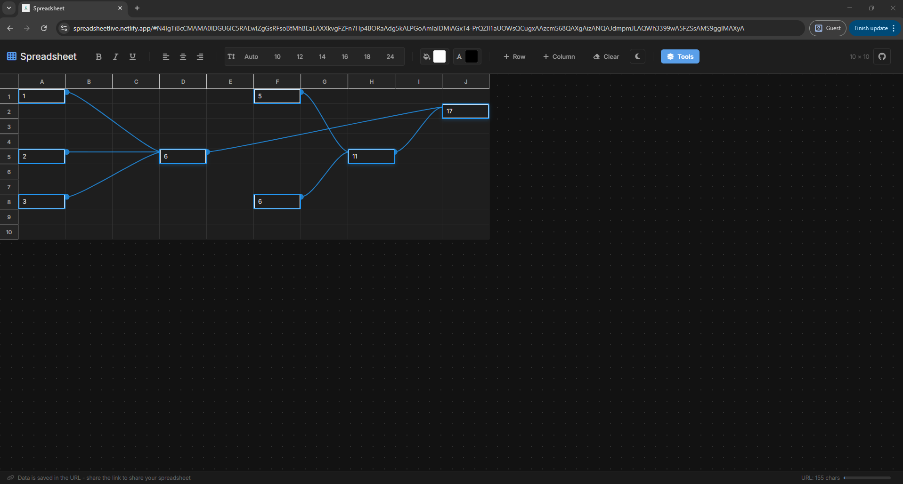
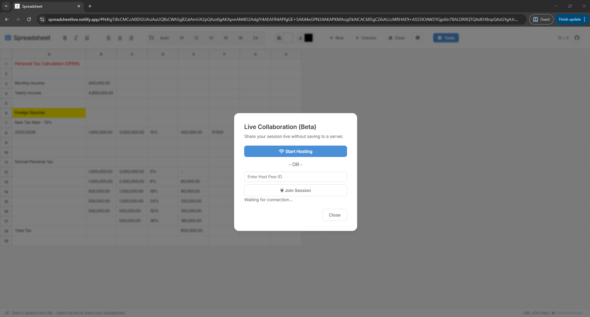

# Spreadsheet


A lightweight, client-only spreadsheet web application. All data persists in the URL hash for instant sharing—no backend required. Optional AES-GCM password protection keeps shared links locked without a server.


[](https://app.netlify.com/projects/spreadsheetlive/deploys)

## Demo Links

- [Open example](https://spreadsheetlive.netlify.app/#N4IgTiBcCMCcA0IDGUAciAuUQBMCGYA1iIjlANrkAM8NIACgKZgDOA9gHZ4A2ABACp4AHrwDCPJAFdueDAEtOvABQB5egFEAcgEoQAXXjkATLUQBZThgAW3AJ68AkhyRsAto32GT0RL14AWKhogqgA6IN5PcgBmUxAATUYCO0dnNw8DGPgfED9-eFQg2iDwqkjMgFY4gDE2MEY5AHMOXgBlNkkwJEYWKIA2OM1GAHcBYV4AJVlGXgBaXmgKgFIogHY4oyojCoB6TaM+tezfBYKikNLyw3WTXN5YkOKwiKPYkEWVzPX8u-8K4JKLy+8CqIGiq3+VCi0GCiE0dVcPF4TFYnCRgiE0J8OT8PkKAOeZSx8Fufge50BRMy0B8byon0MNPgPz88z80O8Jx8jwuQMZJlJvBMPMpV3I0BMbz6DPFJhZvD6BMu0NiON4kKeyupsUFPg1vKpjNib2gqBl0Fi8tgSr54vyav1ouh+V1T01tug+TeRn85vy8olNsN4qqDophLFixJJ0dEehVTe0Xp8eZXP+7uD0AGgtjWsZA0T0uhAwDhQzkfWdH4bAw6OE0O+J0VQfKBhAvUglFhoBQkBAAGIAGaDkJQxAAL2wnpAAF9KqZQAAjbBDweMRhBEjIFejzdztvDChGaIIGE0M-ZIoX69XoJ6GdAA)
- [Encrypted example](https://spreadsheetlive.netlify.app/#ENC:JdpgBVSwRexyozWBU7kKmrSS8rmcirmh6S9ljc_F9GafTzv1JHdgxl0uDHQiy7Xi1_lMahO87faWio0gS_nkYrMb4Vea6YtXhDKvbaTN4lt3BRiE6_DcKb9PWqXKi9_5cz-apyepJKZ0rSqtBfT9RXmMqtDVhPaHeNS33tJXhhn-mM34UVr8Vb5IgLqFo3lv-2wppfhurJUnRyEDK49ybJiLI72lpo93_3-o2UxRikeZ98G_Wce1-CtHJYgPCl5eZ3ILX_Vu94zTVdigCFIR5GTvhsfbp7nMEe6BqurTsTSdpiDyQ_6FOMlUMpGjDGqZDlkMMYv_4KfD6GcqNvihxA0Fcgrxty9YNhSaW2KxC9V0wPEKYIutKLaIjHmnS8jO8Lyr5mCy4IKI5Yoji-gT6obHAq3Ln389Mg_9FPDYDQoU71D-O9NDthfPjR7LoujRKtcEpU7kDc_qSaSzCWYWG5o6YFC_Y_NcTLroeI3T6sFQXwU9Safjeb9WKWgxVnXWZr3mD5KBv-f0er7wlbWT_H8S1cw9WqIsbpQtfOZkahexy8ZDbLdB-SXXSqjJl18s08nlx7n4RNVitKo2VYbnV4jEE5lYKLApYMEYiS8EvDRFEu0L-9KmhtaeQ_hhXVrj_qiVznHHxpTwaxlPgG67WFfz-zz4-5RznFxjVRlMIaJkuxkcSbebBFqK_oNZ0-MwvNRvUnkC0z-opXjFH_B0mlTCu62hylMObNP6UQ7bzgxgC6hZ-loGx03i8hN0IuXIJ7oeTUa9hpJjxY5mDig2T83PkfEQyyRzIle4L7Ije92qxqvAmsoGUrbUIUzHe8S1iY6AOSKxHL2RZ6KRyBE2APci2Z1ytRpgyuiT_QQXwSws0TZO9DdeJ6ENkWxRPNSOi1tb8v89-ZG-GZqJRnRIomxF_Wiq5cZQJrOecYCJZB6GD8EYQNuJy99LmDsOtw)
  - Password: `A2P7peq8aVixgB2`

## Screenshots

| Default grid                                     | Password prompt                                        |
| ------------------------------------------------ | ------------------------------------------------------ |
|  |  |

| Unlock encrypted link          | Raw JSON modal                 |
| ------------------------------ | ------------------------------ |
|  |  |

| Embed generator                 | QR handoff               |
| ------------------------------- | ------------------------ |
|  |  |

| Menu                        | Template gallery                                 |
| --------------------------- | ------------------------------------------------ |
|  |  |

| JSON Hash Tool                                 | Formula dependencies                           |
| ---------------------------------------------- | ---------------------------------------------- |
|  |  |

| Live Collaboration                   |     |
| ------------------------------------ | --- |
|  |     |

## Features

### Core Functionality

- **Client-only** - All state saved in URL hash; no backend required
- **Compressed URL State** - LZ-String compression keeps share links short
- **Instant Sharing** - Copy URL to share your spreadsheet with anyone
- **Dynamic Grid** - Expandable grid; add as many rows/columns as you need
- **Arrow Key Navigation** - Move the active cell with arrow keys; Shift+Arrow expands selection
- **Persistent History** - Browser back/forward buttons restore previous states

### Text & Cell Styling

- **Bold** (Ctrl+B) - Apply bold formatting to selected text
- **Italic** (Ctrl+I) - Apply italic formatting to selected text
- **Underline** (Ctrl+U) - Apply underline formatting to selected text
- **Alignment** - Left/center/right alignment per cell or selection
- **Font Size** - Quick size buttons (Auto, 10-24px)
- **Cell Colors** - Background and text color pickers
- **Style Persistence** - Alignment, colors, and sizes saved in the URL
- Sanitized formatting preserved in cell content (B/I/U/STRONG/EM/SPAN with safe styles)

### Multi-Cell Selection (Google Sheets Style)

- **Click & Drag** - Select rectangular ranges by dragging
- **Shift+Click** - Extend selection from anchor point
- **Shift+Arrow** - Extend selection with the keyboard
- **Visual Feedback** - Selected cells highlighted with blue background
- **Border Outline** - Blue border around selection edges
- **Header Highlighting** - Row/column headers highlight for selected range
- **Hover Highlighting** - Row/column hover highlights for quick scanning
- **Escape to Clear** - Press Escape to deselect
- **Selection Stats** - Status bar shows count, sum, and average for numeric ranges

### Grid Management

- **Add Row** - Expand grid rows as needed
- **Add Column** - Expand grid columns as needed
- **Row/Column Menus** - Header menus for quick insert/delete actions
- **Resize Rows/Columns** - Drag header handles to adjust sizes
- **Clear Spreadsheet** - Reset to empty 10x10 grid with confirmation
- **Live Grid Size** - Display shows current dimensions

### Data Import/Export

- **CSV Import** - Load .csv files from the toolbar
- **CSV Export** - Download the current grid as `spreadsheet.csv`
- **Excel Export** - Download as `.xlsx` with formulas and basic formatting
- **Formula-aware Import** - SUM/AVG formulas are preserved; unsupported formulas are imported as text

### Tools Menu

- **Centralized Actions** - Access templates, import/export, sharing, presentation, and collaboration in one place
- **Grouped Categories** - View, Data & File, Share & Embed, and Advanced sections

### Templates Gallery

- **Searchable Gallery** - Browse built-in templates loaded from `templates.json`
- **One-click Launch** - "Use Template" opens a new tab with the template prefilled
- **Pre-built Examples** - Todo lists, budgets, calculators, and trackers

### Presentation Mode

- **Row-based Slides** - Each non-empty row becomes a slide; first cell is the title
- **Keyboard Navigation** - Arrow/Page/Space/Home/End keys move between slides
- **Quick Exit** - Escape closes the presentation overlay
- **Visual Formula Widgets** - `=PROGRESS()`, `=TAG()`, and `=RATING()` render as visuals

### Sharing & Access Control

- **Copy Link** - One click to copy the compressed URL hash
- **Read-only Toggle** - Share view-only links that disable editing
- **Embed Mode** - Generate a read-only iframe snippet with a dedicated `embed` flag in the URL
- **QR Handoff** - Show a QR code to continue editing on mobile; warns if the URL is too long
- **URL Length Indicator** - Live character count with warning/caution/critical thresholds

### Live Collaboration (Beta)

- **Peer-to-peer via PeerJS** - Browser-to-browser sync using WebRTC data channels
- **TURN Server Support** - Metered.ca TURN servers for NAT traversal; credentials fetched securely via Netlify Function
- **1-to-1 only** - One host and one joiner at a time (extra peers are rejected)
- **Real-time Sync** - Cell edits, formulas, and cursor positions broadcast instantly
- **Initial State Transfer** - Host sends complete spreadsheet state when joiner connects
- **Remote Cursor Presence** - See where the other user is editing in real-time
- **Automatic Fallback** - Falls back to STUN-only if TURN unavailable (~80% success rate)
- **Formula Commit Sync** - Computed values broadcast when formulas are confirmed
- **CSP/network requirement** - Allow `unpkg.com`, `*.peerjs.com`, and `*.metered.live`

### Password Protection

- **One-click lock** - Set a password from the toolbar lock button; password never leaves the browser
- **AES-GCM 256 + PBKDF2** - 100k iterations with random salt/IV, stored as URL-safe Base64
- **ENC-prefixed URLs** - Encrypted hashes use `ENC:`; recipients must unlock via modal
- **Optional** - Unencrypted links continue to work exactly as before

### AI Bridge (Raw JSON)

- **Raw Data Modal** - View and copy the minified spreadsheet state as JSON for AI edits
- **Clipboard Ready** - Copy button for quick transfer to ChatGPT/Claude
- **Safe Export** - Uses sanitized/minified state (only non-default values) for shorter prompts
- **JSON Hash Tool** - Convert AI-edited JSON into a shareable URL hash, or decode a hash back to JSON

### Formula Support

- **SUM / AVG Functions** - Calculate totals or averages with `=SUM(A1:B5)` / `=AVG(A1:B5)`
- **Formula Autocomplete** - Dropdown suggestions appear when typing `=`
- **Range Selection** - Click/drag cells while editing to insert range references
- **Live Evaluation** - Formulas evaluate on Enter or when leaving the cell
- **Recalculation** - Dependent formulas update when referenced cells change
- **Error Handling** - Shows `#REF!` for invalid ranges, `#ERROR!` for unknown formulas
- **Shareable Formulas** - Formulas preserved in URL for sharing

### Visual Formula Dependency Tracer

- **Trace Logic Overlay** - Click the diagram button to draw SVG curves from sources to formulas
- **Range Awareness** - Ranges render from the center of the referenced block
- **Auto Redraw** - Updates on edits, scroll, resize, and grid changes

### Theme Support

- **Dark/Light Mode** - Toggle with sun/moon button
- **System Detection** - Respects OS dark mode preference
- **Persistent Theme** - Saved to localStorage and URL
- **Smooth Transitions** - Elegant theme switching animation

### Mobile & Touch Support

- **Touch Selection** - Drag-to-select works on touch devices
- **Responsive Design** - Adapts to all screen sizes
- **iOS Optimized** - 16px font prevents auto-zoom
- **Touch-Friendly** - Larger tap targets on mobile

### Accessibility

- **ARIA Labels** - Screen reader support (e.g., "Cell A1")
- **Keyboard Navigation** - Arrow keys move selection; formatting shortcuts supported
- **Tooltips** - Descriptive hints on all controls
- **Focus Management** - Proper focus handling

### Security & Privacy

- **Password-protected links** - AES-GCM encryption with PBKDF2 key derivation; tampering detection via GCM tag
- **HTML Sanitization** - DOMParser-based whitelist for tags and safe styles
- **Formula Validation** - Only SUM/AVG range syntax and visual formulas (CHART) are accepted in formulas
- **Safe URL Parsing** - Prototype pollution guards and hash length checks
- **Style Guardrails** - CSS color validation for user-provided styles
- **Content Security Policy** - CSP restricts scripts/styles/imgs/fonts to trusted sources
- **Analytics Hygiene** - URL hash excluded from Google Analytics page tracking

## Quick Start

Open `index.html` directly in your browser, or use a local server:

```bash
npx serve .
```

## Docker Deployment

This project includes Docker configuration for easy containerization and deployment.

### Prerequisites

- Docker and Docker Compose installed on your system
- See [Docker installation guide](https://docs.docker.com/get-docker/) for your OS

### Using Docker Compose (Recommended)

The simplest way to run the application:

```bash
docker compose up -d
```

The application will be available at `http://localhost`. To stop:

```bash
docker compose down
```

### Using Docker Directly

Build the image:

```bash
docker build -t spreadsheet:latest .
```

Run a container:

```bash
docker run -d \
  --name spreadsheet-app \
  -p 80:80 \
  -p 443:443 \
  spreadsheet:latest
```

View logs:

```bash
docker logs -f spreadsheet-app
```

Stop the container:

```bash
docker stop spreadsheet-app
docker rm spreadsheet-app
```

### Configuration

**Environment Variables:**

- `TZ`: Timezone setting (default: UTC)

**Volume Mounts:**
For development with live reloading, uncomment the volume mount in `docker-compose.yaml`:

```yaml
volumes:
  - ./:/srv:ro
```

### Architecture

- **Base Image**: `caddy:2-alpine` - Lightweight web server with automatic HTTPS support
- **Build Stage**: Node.js base for dependency management
- **Served Files**: All static assets from the repository
- **Compression**: gzip compression enabled for text content
- **Caching**: Aggressive caching for static assets (1 year), no-cache for HTML
- **Health Check**: Built-in health monitoring every 30 seconds

### Docker Files

- **Dockerfile** - Multi-stage build for optimal image size
- **docker-compose.yaml** - Orchestration with health checks and networking
- **.dockerignore** - Excludes unnecessary files from the Docker build context
- **Caddyfile** - Web server configuration with caching and SPA routing

### HTTPS Support

By default, the container serves HTTP on port 80. For HTTPS:

1. Mount an SSL certificate to the container
2. Update the `Caddyfile` to include your domain and certificate paths
3. Expose port 443

Example for Let's Encrypt with Caddy:

```yaml
volumes:
  - ./data:/data # For certificate storage
  - ./config:/config # For Caddy configuration
```

Update the Caddyfile:

```
yourdomain.com {
    file_server
    encode gzip
}
```

Caddy will automatically obtain and renew certificates.

### Performance Optimization

- **Image Size**: ~30MB (compressed) using Alpine Linux
- **Startup Time**: <1 second
- **Memory Usage**: ~50MB idle
- **Build Cache**: Leverages Docker layer caching for fast rebuilds

## How It Works

Your spreadsheet state is stored entirely in the URL hash. The hash is LZ-String compressed JSON to keep links short, and only non-default data is included. When password protection is enabled, that compressed string is encrypted with AES-GCM (256-bit) using a PBKDF2-derived key (100k iterations, random salt/IV) and stored as URL-safe Base64 with an `ENC:` prefix. The password never leaves the browser; recipients must enter it to decrypt locally.

Example state (decompressed, before encryption, minified format used by `templates.json`):

```
{
  "r": 2,
  "c": 2,
  "t": "light",
  "d": [
    [0, 0, "1"],
    [1, 0, "2"],
    [1, 1, "3"]
  ],
  "f": [
    [1, 1, "=SUM(A1:A2)"]
  ],
  "s": [
    [0, 0, { "a": "center", "b": "#f5f5f5", "c": "#111", "z": "14" }]
  ],
  "w": [120, 100],
  "h": [32, 32]
}
```

### Schema (minified)

- `r`: row count
- `c`: column count
- `t`: theme (`"light"` or `"dark"`)
- `d`: data as sparse triplets `[row, col, value]` (only non-empty cells)
- `f`: formulas as sparse triplets `[row, col, "=FORMULA()"]`
- `s`: cell styles as sparse triplets `[row, col, { a, b, c, z }]` where `a` align, `b` background, `c` text color, `z` font size
- `w`: column widths array (length = `c`, optional)
- `h`: row heights array (length = `r`, optional)

Missing keys imply defaults; sparse arrays are expanded to dense grids on load.

When you edit cells, the URL updates automatically (debounced at 200ms). Formulas are stored separately from displayed values, so both the results and the original formulas are preserved. Column widths, row heights, and cell styles are saved too. Incoming URL state is sanitized and validated (DOMParser whitelist, formula regex, safe JSON parsing), oversized hashes are rejected, and legacy uncompressed hashes are still supported.

## Usage

| Action                | How                                                         |
| --------------------- | ----------------------------------------------------------- |
| Edit cell             | Double-click a cell or click and start typing               |
| Format text           | Select text, click B/I/U buttons or use Ctrl+B/I/U          |
| Align text            | Click left/center/right alignment buttons                   |
| Set font size         | Use size buttons (Auto, 10-24)                              |
| Set cell colors       | Use background/text color pickers                           |
| Resize column/row     | Drag header resize handles                                  |
| Navigate cells        | Arrow keys (when not editing)                               |
| Select range          | Click and drag across cells                                 |
| Extend selection      | Shift+Click or Shift+Arrow                                  |
| Clear selection       | Press Escape                                                |
| Add row               | Click "+ Row" button                                        |
| Add column            | Click "+ Column" button                                     |
| Clear all             | Click "Clear" button (with confirmation)                    |
| Import CSV            | Click import button and choose a .csv file                  |
| Export CSV            | Click download button                                       |
| Toggle read-only      | Click the pen/eye icon to switch between edit and view-only |
| Generate embed code   | Click the `</>` button to copy an iframe snippet            |
| Open raw JSON (AI)    | Click the file-code button to view/copy JSON                |
| Open template gallery | Tools -> Template Gallery                                   |
| Start presentation    | Tools -> Presentation Mode                                  |
| Copy URL              | Click the copy button in the toolbar                        |
| Open on mobile (QR)   | Click the QR button to show a scannable code                |
| Enter formula         | Type `=` followed by function (e.g., `=SUM(A1:B5)`)         |
| Select formula range  | Click/drag cells while editing a formula                    |
| Trace dependencies    | Click the diagram/trace button in the toolbar               |
| Share                 | Click copy button to copy URL                               |
| Lock with password    | Click the lock icon (open) and set a password in the modal  |
| Unlock encrypted link | Open the link, enter password in the modal to decrypt       |
| Remove password       | Click the lock icon (closed) and confirm removal            |
| Toggle theme          | Click sun/moon icon                                         |
| Start P2P hosting     | Tools → Live Collaboration → Start Hosting                  |
| Join P2P session      | Tools → Live Collaboration → Enter Host ID → Join           |

## Keyboard Shortcuts

| Shortcut                         | Action                                                                              |
| -------------------------------- | ----------------------------------------------------------------------------------- |
| Ctrl+B                           | Bold                                                                                |
| Ctrl+I                           | Italic                                                                              |
| Ctrl+U                           | Underline                                                                           |
| Arrow keys                       | Move selection (when not editing)                                                   |
| Shift+Arrow                      | Extend selection                                                                    |
| Enter                            | Evaluate formula and move down (or insert formula suggestion when dropdown is open) |
| Escape                           | Clear selection / Close formula dropdown / Exit presentation mode                   |
| Space / PageDown / ArrowDown     | Next slide (presentation mode)                                                      |
| PageUp / ArrowUp                 | Previous slide (presentation mode)                                                  |
| Home / End                       | First/last slide (presentation mode)                                                |
| Arrow Up/Down (formula dropdown) | Navigate suggestions                                                                |
| Tab (formula dropdown)           | Insert active suggestion                                                            |

## Tech Stack

- Vanilla HTML/CSS/JavaScript (no frameworks)
- CSS Grid for spreadsheet layout
- CSS Custom Properties for theming
- LZ-String (URL state compression via CDN)
- Web Crypto API (AES-GCM + PBKDF2) for optional password protection
- PeerJS 1.5.2 (WebRTC abstraction for P2P collaboration)
- Netlify Functions (serverless TURN credential proxy)
- Metered.ca (TURN server service for NAT traversal)
- Font Awesome 6.5.1 (icons via CDN)
- Google Analytics (gtag.js) for usage tracking
- No build tools required

## Browser Support

| Browser        | Support              |
| -------------- | -------------------- |
| Chrome         | Full                 |
| Firefox        | Full                 |
| Safari         | Full                 |
| Edge           | Full                 |
| Mobile Safari  | Full                 |
| Chrome Android | Full                 |
| Older browsers | Graceful degradation |

## Limitations

- Default grid: 10 rows x 10 columns (expand as needed)
- Formulas limited to SUM/AVG range syntax plus visual formulas (CHART); CHART currently accepts comma-separated numbers only
- Very large sheets may hit browser performance or URL length limits; encrypted links are longer
- Losing the password means the encrypted data cannot be recovered
- P2P collaboration limited to 1 host + 1 joiner (no multi-user rooms)
- P2P requires WebRTC support (modern browsers only)
- Without TURN server, P2P may fail on restrictive networks (~20% of cases)

## File Structure

```
spreadsheet/
|-- index.html                  # Single-page app structure
|-- styles.css                  # Main styling
|-- script.js                   # Application logic
|-- templates.json              # Template definitions + minified sheet data
|-- example.json.md             # Example minified JSON schema doc
|-- netlify.toml                # Netlify configuration for functions
|-- modules/
|   |-- constants.js            # Config constants + key maps
|   |-- csvManager.js           # CSV import/export
|   |-- dependencyTracer.js     # SVG dependency overlay
|   |-- encryption.js           # AES-GCM encryption utilities
|   |-- formulaManager.js       # Formula evaluation & autocomplete
|   |-- hashToolManager.js      # Hash <-> JSON tool modal
|   |-- jsonManager.js          # Raw JSON modal (AI bridge)
|   |-- p2pManager.js           # P2P connection & data sync
|   |-- passwordManager.js      # Password modal UI flows
|   |-- presentationManager.js  # Presentation mode
|   |-- rowColManager.js        # Grid rendering & selection
|   |-- security.js             # HTML sanitization & validation
|   |-- templateManager.js      # Templates gallery + loader
|   |-- toastManager.js         # Toast notifications
|   |-- urlManager.js           # URL state compression & validation
|   `-- visualFunctions.js      # Visual formula helpers
|-- netlify/
|   `-- functions/
|       `-- get-turn-credentials.mjs  # TURN credential proxy
|-- demo/
|   `-- *.png                   # README screenshots
|-- Caddyfile                   # Caddy reverse proxy config
|-- Dockerfile                  # Docker image build
|-- docker-compose.yaml         # Docker compose config
|-- LICENSE                     # License
|-- logo.png                    # App logo
|-- favicon.png                 # Browser favicon
`-- README.md                   # This file
```

## Architecture

- **State Management** - `data`, `formulas`, `cellStyles`, `rows`, `cols`, `colWidths`, `rowHeights`
- **URL Sync** - LZ-String compressed JSON with debounced updates and legacy fallback
- **Event Delegation** - All cell events handled on container
- **CSS Grid** - Dynamic column template and row heights set via JavaScript
- **Sticky Headers** - Row/column headers with z-index layering

## P2P Architecture

### Connection Flow

```
┌─────────────────┐                              ┌─────────────────┐
│      HOST       │                              │     JOINER      │
├─────────────────┤                              ├─────────────────┤
│ 1. Click "Start │                              │                 │
│    Hosting"     │                              │                 │
│ 2. Fetch ICE    │                              │                 │
│    servers      │                              │                 │
│ 3. Get Peer ID  │──── Share ID via chat ──────▶│ 4. Enter Host ID│
│                 │                              │ 5. Fetch ICE    │
│                 │                              │    servers      │
│                 │◀──── WebRTC Connection ─────│ 6. Connect      │
│ 7. Send         │                              │                 │
│    INITIAL_SYNC │─────────────────────────────▶│ 8. Load state   │
│                 │                              │                 │
│ 9. Edit cell    │──── UPDATE_CELL ───────────▶│ 10. Update cell │
│                 │◀─── UPDATE_CELL ────────────│ 11. Edit cell   │
│                 │                              │                 │
│ 12. Move cursor │──── UPDATE_CURSOR ─────────▶│ 13. Show cursor │
└─────────────────┘                              └─────────────────┘
```

### ICE Server Configuration

The app uses a Netlify Function to securely fetch TURN credentials:

1. **Client** calls `/api/turn-credentials`
2. **Netlify Function** reads `METERED_API_KEY` from environment
3. **Function** fetches credentials from Metered.ca API
4. **Client** receives ICE servers with TURN credentials
5. **Credentials** cached for 1 hour to reduce API calls

**Fallback**: If TURN unavailable, falls back to Google STUN servers (limited NAT traversal)

### Message Types

| Type            | Direction     | Purpose                                        |
| --------------- | ------------- | ---------------------------------------------- |
| `INITIAL_SYNC`  | Host → Joiner | Complete spreadsheet state on connection       |
| `FULL_SYNC`     | Host → Joiner | Re-sync after structural changes (add row/col) |
| `UPDATE_CELL`   | Bidirectional | Incremental cell update (value + formula)      |
| `UPDATE_CURSOR` | Bidirectional | Remote cursor position for presence            |
| `SYNC_REQUEST`  | Joiner → Host | Request full state if out of sync              |

### P2P Security

- **API Key Protection** - TURN API key stored server-side in Netlify env var
- **HTML Sanitization** - All incoming cell values sanitized via DOMParser whitelist
- **Formula Validation** - Only SUM/AVG and visual formulas (CHART) allowed (regex validation)
- **Bounds Checking** - Cell updates validated against grid dimensions
- **No E2E Encryption** - Data channel uses DTLS (transport encryption only)

## Development

No build process required. Edit files and refresh browser.

```bash
# Start local server
npx serve .

# Open in browser
http://localhost:3000
```

## TURN Server Setup (Self-Hosting)

To enable P2P collaboration with full NAT traversal support, you need to configure a TURN server. The app uses Metered.ca (free tier: 50GB/month).

### 1. Create Metered.ca Account

1. Sign up at [https://www.metered.ca](https://www.metered.ca)
2. Go to **Dashboard → Developers**
3. Copy your **API Key**

### 2. Configure Netlify Environment Variable

In your Netlify dashboard:

1. Go to **Site settings → Environment variables**
2. Add a new variable:
   - **Key**: `METERED_API_KEY`
   - **Value**: Your Metered.ca API key
   - **Scope**: Functions

### 3. Deploy

Push your code to trigger a Netlify deploy. The function at `netlify/functions/get-turn-credentials.mjs` will automatically use the API key.

### 4. Local Testing with Netlify Dev

```bash
# Install Netlify CLI
npm install -g netlify-cli

# Create .env file for local testing
echo "METERED_API_KEY=your_api_key_here" > .env

# Run with functions support
netlify dev
```

### Without TURN Server

If `METERED_API_KEY` is not configured:

- P2P will use **STUN-only** mode (Google STUN servers)
- Works in ~80% of network configurations
- May fail behind symmetric NATs or strict firewalls

## Recent Updates

### Latest - Tools Menu + Excel Export + JSON Hash Tool

- Added a centralized Tools menu with grouped categories for faster access
- Added Excel (.xlsx) export with formulas and basic formatting
- Added JSON Hash Tool to convert JSON ↔ URL hashes with size stats
- Added row/column header menus for quick insert/delete actions

### Recent - Template Gallery + Presentation Mode

- Added a searchable Template Gallery with pre-built sheets from `templates.json`
- One-click "Use Template" opens a new tab with the template prefilled
- Added Presentation Mode to turn rows into slides with keyboard navigation
- Presentation renders visual formulas: `=PROGRESS()`, `=TAG()`, and `=RATING()`

### Recent - Visual Dependency Tracer + P2P Formula Sync

- Added a Trace Logic overlay that renders formula dependencies with SVG curves
- Auto redraws on edits, scroll, resize, and grid updates
- Fixed P2P formula commits to broadcast computed values reliably

### AI Bridge, Embed, and Sharing Upgrades

- Added Raw Data (AI Bridge) modal to view/copy the current JSON state
- Read-only toggle and dedicated embed mode with iframe snippet generator
- QR handoff modal to open the sheet on mobile; warns on oversized URLs
- Live URL length indicator plus selection count/sum/avg stats in the status bar

### Optional Password Protection

- Added AES-GCM (256-bit) encryption with PBKDF2 (100k iterations) for URL hashes (`ENC:` prefix)
- Lock/unlock toolbar button with modal flows for setting, unlocking, and removing passwords
- URL-safe Base64 payloads; encryption failures fall back safely without breaking sharing

### v1.4 - Keyboard Navigation

- Arrow keys move the active selection without entering edit mode
- Shift+Arrow expands selections from the anchor cell
- Double-click or start typing to enter edit mode

### v1.3 - Formula Support

- Added formula evaluation with `=SUM(range)` function
- Formula autocomplete dropdown with suggestions
- Click-to-select range references while editing formulas
- Keyboard navigation in formula dropdown (Up/Down/Enter/Tab/Escape)
- Formulas preserved in shareable URLs
- Enter key evaluates formula and moves to next row

### v1.2 - Multi-Cell Selection & Clear

- Added Google Sheets-style multi-cell selection
- Click and drag to select cell ranges
- Shift+Click to extend selections
- Visual selection with border outline
- Added Clear button to reset spreadsheet
- Touch/mobile selection support

### v1.1 - Text Formatting

- Added Bold, Italic, Underline buttons
- Keyboard shortcuts (Ctrl+B/I/U)
- Active header highlighting

### v1.0 - Initial Release

- Core spreadsheet functionality
- URL-based state persistence
- Dark/light theme toggle
- Dynamic grid sizing
- Mobile responsive design

## License

MIT

## Contributing

1. Fork the repository
2. Create your feature branch
3. Commit your changes
4. Push to the branch
5. Open a Pull Request
