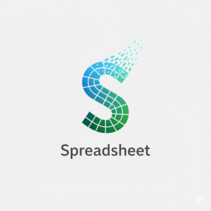
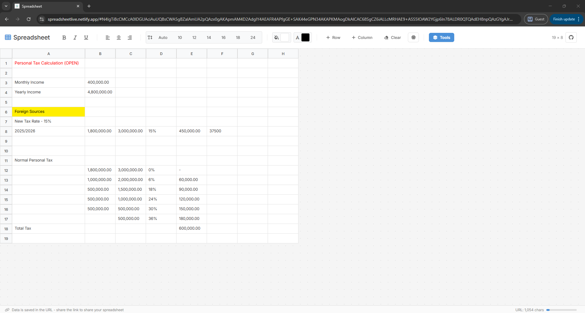
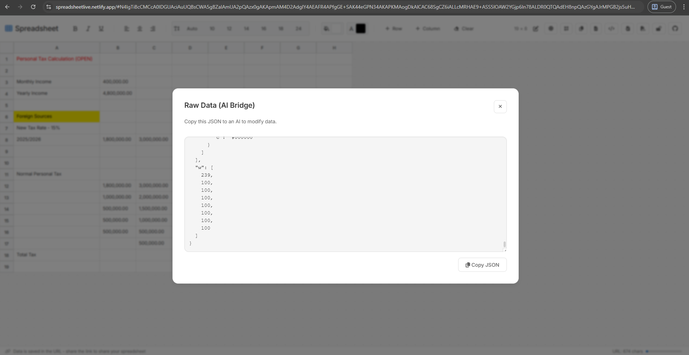
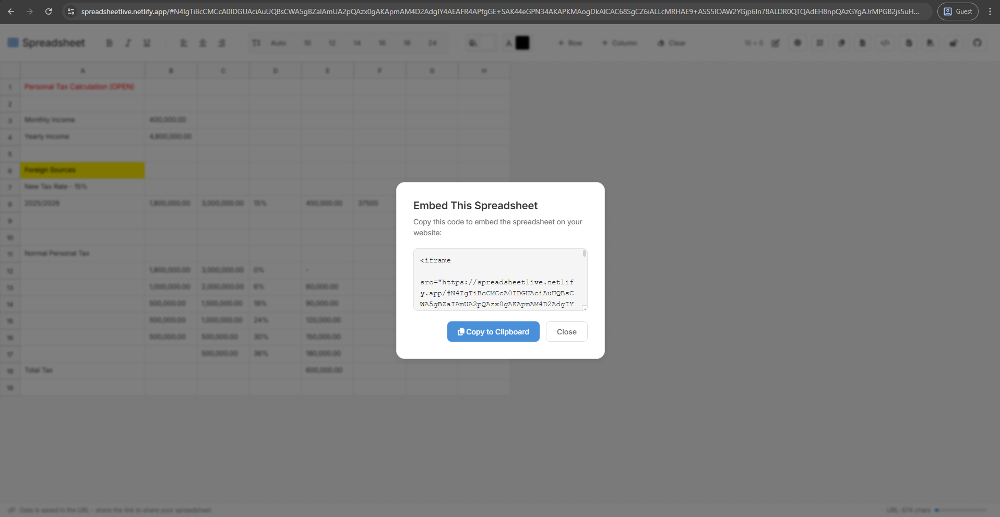
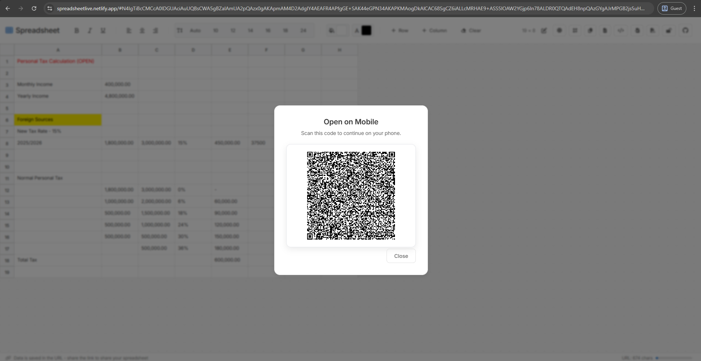

# Spreadsheet



A lightweight, client-only spreadsheet web application. All data persists in the URL hash for instant sharing—no backend required. Optional AES-GCM password protection keeps shared links locked without a server.


## Demo Links

- [Open example](https://spreadsheetlive.netlify.app/#N4IgTiBcCMCcA0IDGUAciAuUQBMCGYA1iIjlANrkAM8NIACgKZgDOA9gHZ4A2ABACp4AHrwDCPJAFdueDAEtOvABQB5egFEAcgEoQAXXjkATLUQBZThgAW3AJ68AkhyRsAto32GT0RL14AWKhogqgA6IN5PcgBmUxAATUYCO0dnNw8DGPgfED9-eFQg2iDwqkjMgFY4gDE2MEY5AHMOXgBlNkkwJEYWKIA2OM1GAHcBYV4AJVlGXgBaXmgKgFIogHY4oyojCoB6TaM+tezfBYKikNLyw3WTXN5YkOKwiKPYkEWVzPX8u-8K4JKLy+8CqIGiq3+VCi0GCiE0dVcPF4TFYnCRgiE0J8OT8PkKAOeZSx8Fufge50BRMy0B8byon0MNPgPz88z80O8Jx8jwuQMZJlJvBMPMpV3I0BMbz6DPFJhZvD6BMu0NiON4kKeyupsUFPg1vKpjNib2gqBl0Fi8tgSr54vyav1ouh+V1T01tug+TeRn85vy8olNsN4qqDophLFixJJ0dEehVTe0Xp8eZXP+7uD0AGgtjWsZA0T0uhAwDhQzkfWdH4bAw6OE0O+J0VQfKBhAvUglFhoBQkBAAGIAGaDkJQxAAL2wnpAAF9KqZQAAjbBDweMRhBEjIFejzdztvDChGaIIGE0M-ZIoX69XoJ6GdAA)
- [Encrypted example](https://spreadsheetlive.netlify.app/#ENC:JdpgBVSwRexyozWBU7kKmrSS8rmcirmh6S9ljc_F9GafTzv1JHdgxl0uDHQiy7Xi1_lMahO87faWio0gS_nkYrMb4Vea6YtXhDKvbaTN4lt3BRiE6_DcKb9PWqXKi9_5cz-apyepJKZ0rSqtBfT9RXmMqtDVhPaHeNS33tJXhhn-mM34UVr8Vb5IgLqFo3lv-2wppfhurJUnRyEDK49ybJiLI72lpo93_3-o2UxRikeZ98G_Wce1-CtHJYgPCl5eZ3ILX_Vu94zTVdigCFIR5GTvhsfbp7nMEe6BqurTsTSdpiDyQ_6FOMlUMpGjDGqZDlkMMYv_4KfD6GcqNvihxA0Fcgrxty9YNhSaW2KxC9V0wPEKYIutKLaIjHmnS8jO8Lyr5mCy4IKI5Yoji-gT6obHAq3Ln389Mg_9FPDYDQoU71D-O9NDthfPjR7LoujRKtcEpU7kDc_qSaSzCWYWG5o6YFC_Y_NcTLroeI3T6sFQXwU9Safjeb9WKWgxVnXWZr3mD5KBv-f0er7wlbWT_H8S1cw9WqIsbpQtfOZkahexy8ZDbLdB-SXXSqjJl18s08nlx7n4RNVitKo2VYbnV4jEE5lYKLApYMEYiS8EvDRFEu0L-9KmhtaeQ_hhXVrj_qiVznHHxpTwaxlPgG67WFfz-zz4-5RznFxjVRlMIaJkuxkcSbebBFqK_oNZ0-MwvNRvUnkC0z-opXjFH_B0mlTCu62hylMObNP6UQ7bzgxgC6hZ-loGx03i8hN0IuXIJ7oeTUa9hpJjxY5mDig2T83PkfEQyyRzIle4L7Ije92qxqvAmsoGUrbUIUzHe8S1iY6AOSKxHL2RZ6KRyBE2APci2Z1ytRpgyuiT_QQXwSws0TZO9DdeJ6ENkWxRPNSOi1tb8v89-ZG-GZqJRnRIomxF_Wiq5cZQJrOecYCJZB6GD8EYQNuJy99LmDsOtw)
  - Password: `A2P7peq8aVixgB2`

## Screenshots

- Default grid (unencrypted):  
  
- Password prompt before encrypting:  
  
- Unlocking an encrypted link:  
  
- Raw JSON (AI bridge) modal:  
  
- Embed code generator (read-only iframe):  
  
- QR code for mobile handoff:  
  

## Features

### Core Functionality

- **Client-only** - All state saved in URL hash; no backend required
- **Compressed URL State** - LZ-String compression keeps share links short
- **Instant Sharing** - Copy URL to share your spreadsheet with anyone
- **Dynamic Grid** - Expandable up to 30 rows and 15 columns (A-O)
- **Arrow Key Navigation** - Move the active cell with arrow keys; Shift+Arrow expands selection
- **Persistent History** - Browser back/forward buttons restore previous states

### Text & Cell Styling

- **Bold** (Ctrl+B) - Apply bold formatting to selected text
- **Italic** (Ctrl+I) - Apply italic formatting to selected text
- **Underline** (Ctrl+U) - Apply underline formatting to selected text
- **Alignment** - Left/center/right alignment per cell or selection
- **Font Size** - Quick size buttons (Auto, 10-24px)
- **Cell Colors** - Background and text color pickers
- **Style Persistence** - Alignment, colors, and sizes saved in the URL
- Sanitized formatting preserved in cell content (B/I/U/STRONG/EM/SPAN with safe styles)

### Multi-Cell Selection (Google Sheets Style)

- **Click & Drag** - Select rectangular ranges by dragging
- **Shift+Click** - Extend selection from anchor point
- **Shift+Arrow** - Extend selection with the keyboard
- **Visual Feedback** - Selected cells highlighted with blue background
- **Border Outline** - Blue border around selection edges
- **Header Highlighting** - Row/column headers highlight for selected range
- **Hover Highlighting** - Row/column hover highlights for quick scanning
- **Escape to Clear** - Press Escape to deselect
- **Selection Stats** - Status bar shows count, sum, and average for numeric ranges

### Grid Management

- **Add Row** - Expand grid rows (max 30)
- **Add Column** - Expand grid columns (max 15)
- **Resize Rows/Columns** - Drag header handles to adjust sizes
- **Clear Spreadsheet** - Reset to empty 10x10 grid with confirmation
- **Live Grid Size** - Display shows current dimensions

### Data Import/Export

- **CSV Import** - Load .csv files from the toolbar
- **CSV Export** - Download the current grid as `spreadsheet.csv`
- **Formula-aware Import** - SUM/AVG formulas are preserved; unsupported formulas are imported as text

### Sharing & Access Control

- **Copy Link** - One click to copy the compressed URL hash
- **Read-only Toggle** - Share view-only links that disable editing
- **Embed Mode** - Generate a read-only iframe snippet with a dedicated `embed` flag in the URL
- **QR Handoff** - Show a QR code to continue editing on mobile; warns if the URL is too long
- **URL Length Indicator** - Live character count with warning/caution/critical thresholds

### Password Protection

- **One-click lock** - Set a password from the toolbar lock button; password never leaves the browser
- **AES-GCM 256 + PBKDF2** - 100k iterations with random salt/IV, stored as URL-safe Base64
- **ENC-prefixed URLs** - Encrypted hashes use `ENC:`; recipients must unlock via modal
- **Optional** - Unencrypted links continue to work exactly as before

### AI Bridge (Raw JSON)

- **Raw Data Modal** - View and copy the minified spreadsheet state as JSON for AI edits
- **Clipboard Ready** - Copy button for quick transfer to ChatGPT/Claude
- **Safe Export** - Uses sanitized/minified state (only non-default values) for shorter prompts

### Formula Support

- **SUM / AVG Functions** - Calculate totals or averages with `=SUM(A1:B5)` / `=AVG(A1:B5)`
- **Formula Autocomplete** - Dropdown suggestions appear when typing `=`
- **Range Selection** - Click/drag cells while editing to insert range references
- **Live Evaluation** - Formulas evaluate on Enter or when leaving the cell
- **Recalculation** - Dependent formulas update when referenced cells change
- **Error Handling** - Shows `#REF!` for invalid ranges, `#ERROR!` for unknown formulas
- **Shareable Formulas** - Formulas preserved in URL for sharing

### Theme Support

- **Dark/Light Mode** - Toggle with sun/moon button
- **System Detection** - Respects OS dark mode preference
- **Persistent Theme** - Saved to localStorage and URL
- **Smooth Transitions** - Elegant theme switching animation

### Mobile & Touch Support

- **Touch Selection** - Drag-to-select works on touch devices
- **Responsive Design** - Adapts to all screen sizes
- **iOS Optimized** - 16px font prevents auto-zoom
- **Touch-Friendly** - Larger tap targets on mobile

### Accessibility

- **ARIA Labels** - Screen reader support (e.g., "Cell A1")
- **Keyboard Navigation** - Arrow keys move selection; formatting shortcuts supported
- **Tooltips** - Descriptive hints on all controls
- **Focus Management** - Proper focus handling

### Security & Privacy

- **Password-protected links** - AES-GCM encryption with PBKDF2 key derivation; tampering detection via GCM tag
- **HTML Sanitization** - DOMParser-based whitelist for tags and safe styles
- **Formula Validation** - Only SUM/AVG range syntax is accepted in formulas
- **Safe URL Parsing** - Prototype pollution guards and hash length checks
- **Style Guardrails** - CSS color validation for user-provided styles
- **Content Security Policy** - CSP restricts scripts/styles/imgs/fonts to trusted sources
- **Analytics Hygiene** - URL hash excluded from Google Analytics page tracking

## Quick Start

Open `index.html` directly in your browser, or use a local server:

```bash
npx serve .
```

## How It Works

Your spreadsheet state is stored entirely in the URL hash. The hash is LZ-String compressed JSON to keep links short, and only non-default data is included. When password protection is enabled, that compressed string is encrypted with AES-GCM (256-bit) using a PBKDF2-derived key (100k iterations, random salt/IV) and stored as URL-safe Base64 with an `ENC:` prefix. The password never leaves the browser; recipients must enter it to decrypt locally.

Example state (decompressed, before encryption):

```
{
  "rows": 2,
  "cols": 2,
  "data": [["A1", "B1"], ["A2", "B2"]],
  "formulas": [["", "=SUM(A1:A2)"]],
  "cellStyles": [[{"align": "center", "bg": "#f5f5f5", "color": "#111", "fontSize": "14"}]],
  "colWidths": [120, 100],
  "rowHeights": [32, 32],
  "theme": "light"
}
```

When you edit cells, the URL updates automatically (debounced at 200ms). Formulas are stored separately from displayed values, so both the results and the original formulas are preserved. Column widths, row heights, and cell styles are saved too. Incoming URL state is sanitized and validated (DOMParser whitelist, formula regex, safe JSON parsing), oversized hashes are rejected, and legacy uncompressed hashes are still supported.

## Usage

| Action                | How                                                        |
| --------------------- | ---------------------------------------------------------- |
| Edit cell             | Double-click a cell or click and start typing              |
| Format text           | Select text, click B/I/U buttons or use Ctrl+B/I/U         |
| Align text            | Click left/center/right alignment buttons                  |
| Set font size         | Use size buttons (Auto, 10-24)                             |
| Set cell colors       | Use background/text color pickers                          |
| Resize column/row     | Drag header resize handles                                 |
| Navigate cells        | Arrow keys (when not editing)                              |
| Select range          | Click and drag across cells                                |
| Extend selection      | Shift+Click or Shift+Arrow                                 |
| Clear selection       | Press Escape                                               |
| Add row               | Click "+ Row" button (max 30)                              |
| Add column            | Click "+ Column" button (max 15)                           |
| Clear all             | Click "Clear" button (with confirmation)                   |
| Import CSV            | Click import button and choose a .csv file                 |
| Export CSV            | Click download button                                      |
| Toggle read-only      | Click the pen/eye icon to switch between edit and view-only |
| Generate embed code   | Click the `</>` button to copy an iframe snippet            |
| Open raw JSON (AI)    | Click the file-code button to view/copy JSON                |
| Copy URL              | Click the copy button in the toolbar                        |
| Open on mobile (QR)   | Click the QR button to show a scannable code                |
| Enter formula         | Type `=` followed by function (e.g., `=SUM(A1:B5)`)        |
| Select formula range  | Click/drag cells while editing a formula                   |
| Share                 | Click copy button to copy URL                              |
| Lock with password    | Click the lock icon (open) and set a password in the modal |
| Unlock encrypted link | Open the link, enter password in the modal to decrypt      |
| Remove password       | Click the lock icon (closed) and confirm removal           |
| Toggle theme          | Click sun/moon icon                                        |

## Keyboard Shortcuts

| Shortcut                         | Action                                                                              |
| -------------------------------- | ----------------------------------------------------------------------------------- |
| Ctrl+B                           | Bold                                                                                |
| Ctrl+I                           | Italic                                                                              |
| Ctrl+U                           | Underline                                                                           |
| Arrow keys                       | Move selection (when not editing)                                                   |
| Shift+Arrow                      | Extend selection                                                                    |
| Enter                            | Evaluate formula and move down (or insert formula suggestion when dropdown is open) |
| Escape                           | Clear selection / Close formula dropdown                                            |
| Arrow Up/Down (formula dropdown) | Navigate suggestions                                                                |
| Tab (formula dropdown)           | Insert active suggestion                                                            |

## Tech Stack

- Vanilla HTML/CSS/JavaScript (no frameworks)
- CSS Grid for spreadsheet layout
- CSS Custom Properties for theming
- LZ-String (URL state compression via CDN)
- Web Crypto API (AES-GCM + PBKDF2) for optional password protection
- Font Awesome 6.5.1 (icons via CDN)
- Google Analytics (gtag.js) for usage tracking
- No build tools required

## Browser Support

| Browser        | Support              |
| -------------- | -------------------- |
| Chrome         | Full                 |
| Firefox        | Full                 |
| Safari         | Full                 |
| Edge           | Full                 |
| Mobile Safari  | Full                 |
| Chrome Android | Full                 |
| Older browsers | Graceful degradation |

## Limitations

- Maximum 30 rows
- Maximum 15 columns (A-O)
- Default grid: 10 rows x 10 columns
- Formulas limited to SUM and AVG range syntax
- CSV imports larger than 30x15 are truncated
- URL length limits may apply for very large spreadsheets; encrypted links are longer
- Losing the password means the encrypted data cannot be recovered

## File Structure

```
spreadsheet/
|-- index.html      # Single-page app structure
|-- styles.css      # All styling including dark mode
|-- script.js       # Application logic (IIFE module)
|-- logo.png        # App logo
|-- favicon.png     # Browser favicon
|-- CLAUDE.md       # Development documentation
`-- README.md       # This file
```

## Architecture

- **State Management** - `data`, `formulas`, `cellStyles`, `rows`, `cols`, `colWidths`, `rowHeights`
- **URL Sync** - LZ-String compressed JSON with debounced updates and legacy fallback
- **Event Delegation** - All cell events handled on container
- **CSS Grid** - Dynamic column template and row heights set via JavaScript
- **Sticky Headers** - Row/column headers with z-index layering

## Development

No build process required. Edit files and refresh browser.

```bash
# Start local server
npx serve .

# Open in browser
http://localhost:3000
```

## Recent Updates

### Latest - AI Bridge, Embed, and Sharing Upgrades

- Added Raw Data (AI Bridge) modal to view/copy the current JSON state
- Read-only toggle and dedicated embed mode with iframe snippet generator
- QR handoff modal to open the sheet on mobile; warns on oversized URLs
- Live URL length indicator plus selection count/sum/avg stats in the status bar

### Optional Password Protection

- Added AES-GCM (256-bit) encryption with PBKDF2 (100k iterations) for URL hashes (`ENC:` prefix)
- Lock/unlock toolbar button with modal flows for setting, unlocking, and removing passwords
- URL-safe Base64 payloads; encryption failures fall back safely without breaking sharing

### v1.4 - Keyboard Navigation

- Arrow keys move the active selection without entering edit mode
- Shift+Arrow expands selections from the anchor cell
- Double-click or start typing to enter edit mode

### v1.3 - Formula Support

- Added formula evaluation with `=SUM(range)` function
- Formula autocomplete dropdown with suggestions
- Click-to-select range references while editing formulas
- Keyboard navigation in formula dropdown (Up/Down/Enter/Tab/Escape)
- Formulas preserved in shareable URLs
- Enter key evaluates formula and moves to next row

### v1.2 - Multi-Cell Selection & Clear

- Added Google Sheets-style multi-cell selection
- Click and drag to select cell ranges
- Shift+Click to extend selections
- Visual selection with border outline
- Added Clear button to reset spreadsheet
- Touch/mobile selection support

### v1.1 - Text Formatting

- Added Bold, Italic, Underline buttons
- Keyboard shortcuts (Ctrl+B/I/U)
- Active header highlighting

### v1.0 - Initial Release

- Core spreadsheet functionality
- URL-based state persistence
- Dark/light theme toggle
- Dynamic grid sizing
- Mobile responsive design

## License

MIT

## Contributing

1. Fork the repository
2. Create your feature branch
3. Commit your changes
4. Push to the branch
5. Open a Pull Request
